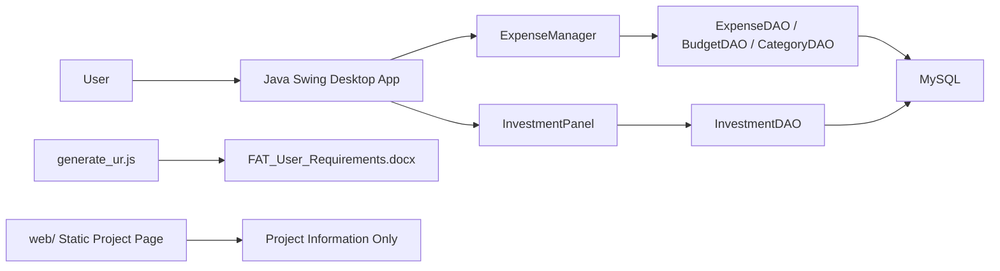

# Design and Architecture

This document describes the repository as it is currently implemented.

## System Overview

FAT is a Java Swing desktop application backed by MySQL through JDBC.

The repository also contains:
- a static project information page in `web/`
- a Node script that generates the Word submission document

## Real Architecture

## Architectural Notes

- The desktop app is the primary product.
- There is no backend API layer between the desktop client and the database.
- Expenses and budgets flow through `ExpenseManager`, which acts as the central subject in the Observer pattern.
- Investments bypass `ExpenseManager` and talk directly to `InvestmentDAO`.
- The `web/` folder is informational only and is separate from runtime application behavior.
- The document generator is a separate Node workflow and is not part of runtime application behavior.

## Package Structure

- `src/app`
  - application entry point
- `src/model`
  - data models: `Expense`, `Budget`, `Category`, `Investment`, `User`
- `src/db`
  - JDBC access and SQL operations
- `src/observer`
  - `Subject`, `Observer`, and `ExpenseManager`
- `src/ui`
  - Swing panels and frame
- `src/util`
  - shared UI helpers, date formatting, and validation

## Main Runtime Flow

### Desktop Startup

1. `app.Main` applies Nimbus styling and opens `MainFrame`.
2. `MainFrame` creates one shared `ExpenseManager`.
3. Tabs are created for Add Expense, Insights, Investments, Transactions, and Dashboard.
4. Observer-based panels refresh when expense or budget data changes.

### Expense And Budget Flow

1. `AddExpensePanel` validates user input.
2. It calls `ExpenseManager`.
3. `ExpenseManager` calls DAO classes.
4. On success, `ExpenseManager` notifies observer panels.
5. Dashboard, Insights, and Transactions refresh from the updated MySQL data.

### Investment Flow

1. `InvestmentPanel` validates user input.
2. It calls `InvestmentDAO` directly.
3. The panel refreshes its own table and summary cards after add, delete, or refresh actions.

## Patterns Used

### Observer Pattern

Used for expense and budget updates:
- `ExpenseManager` is the subject
- Dashboard-related panels and Insights/Transactions act as observers

### DAO Pattern

Used for database access:
- `ExpenseDAO`
- `BudgetDAO`
- `CategoryDAO`
- `InvestmentDAO`

## Database Design

## Schema From `sql/fat_schema.sql`

- `users`
  - `id`
  - `username`
- `categories`
  - `id`
  - `name`
- `budgets`
  - `id`
  - `user_id`
  - `month`
  - `year`
  - `amount`
- `expenses`
  - `id`
  - `user_id`
  - `category_id`
  - `description`
  - `amount`
  - `expense_date`
  - `created_at`

Seed data:
- default user: `default_user`
- default categories: `Food`, `Transport`, `Entertainment`, `Utilities`, `Health`, `Other`

## Runtime-Created Table

`InvestmentDAO` creates the `investments` table automatically when needed.

Columns:
- `id`
- `user_id`
- `name`
- `ticker`
- `type`
- `shares`
- `buy_price`
- `current_price`
- `purchase_date`
- `notes`
- `created_at`

## External Dependencies

Java runtime dependencies:
- MySQL Connector/J
- JFreeChart 1.0.19
- JCommon 1.0.23

Node dependency:
- `docx` for Word document generation only

## Current Constraints

- Single-user implementation using `user_id = 1`
- No login or authentication flow
- No REST API or service layer
- No automated deployment scripts
- No installer or packaged executable
- Dashboard and Insights are monthly views only
- Investments are not integrated into budget calculations

## Submission-Relevant Summary

What should be evaluated as the primary implementation:
- the Java Swing desktop app
- the MySQL schema and runtime database behavior
- the submission-facing documentation in `docs/`

What is optional:
- the static project information page
- the Node document-generation workflow
